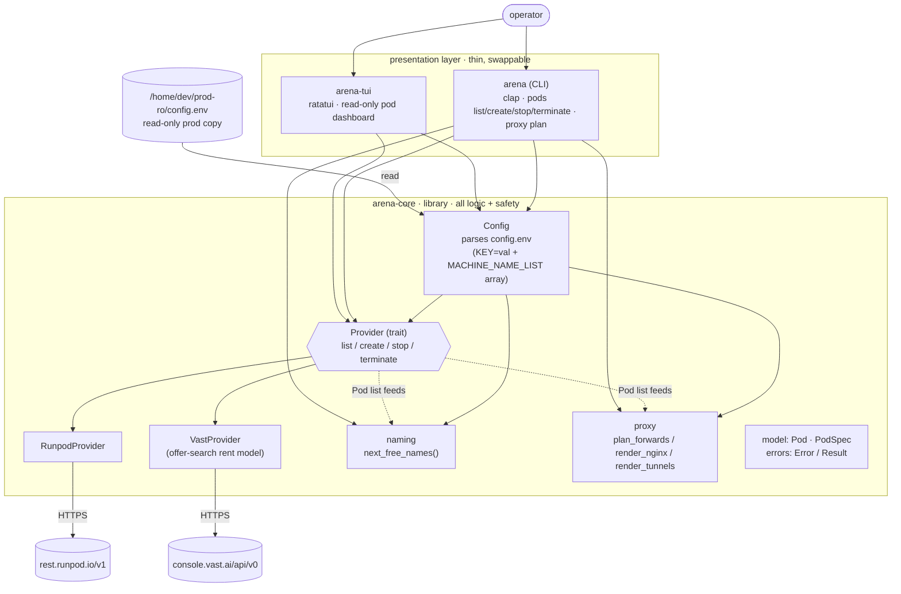

# arena-infra-rs — architecture

A Cargo workspace with one library crate (`arena-core`) holding all logic, and two
thin presentation crates (`arena-cli`, `arena-tui`) that depend on it. Concrete
compute backends hide behind a single `Provider` trait, so the CLI/TUI — and any
future web layer — never mention a specific provider.

## Crates

| crate | binary | role |
|-------|--------|------|
| `arena-core` | — | config parsing, `Provider` trait + RunPod/Vast backends, `Pod`/`PodSpec` model, `naming`, `proxy`, errors |
| `arena-cli` | `arena` | clap CLI over the library (`pods …`, `proxy plan`) |
| `arena-tui` | `arena-tui` | ratatui read-only dashboard |

## Request flow (example: `arena --provider vast pods create -n 3`)

1. `Config::load` reads `config.env` (the read-only prod copy by default).
2. `build_provider("vast", cfg)` constructs a `VastProvider` from `VAST_API_KEY`.
3. `provider.list_pods()` (read-only GET) gets the current pods.
4. `naming::next_free_names` picks the next free `arena8-*` names.
5. For each name a `PodSpec` is built; **dry-run prints what it would do** —
   `--apply` is required before `provider.create_pod()` actually mutates anything.

## Safety model (cross-cutting)

- **Read-only by default**: only `list_pods()` issues GETs; the TUI is GET-only.
- **Mutations are dry-run** unless `--apply` is passed.
- **`proxy plan` never connects** to the proxy host — it renders nginx config +
  SSH-tunnel commands for manual application (`--out` writes the config *locally*).
- **Secrets stay out of git**: `config.env` and `*.key` are git-ignored.

## Extending

- **New compute provider** → one new `impl Provider` in `crates/core/src/provider/`;
  no CLI/TUI changes.
- **New surface (e.g. web UI)** → a new crate depending on `arena-core`; all logic
  already lives in the library, so the core is untouched.
