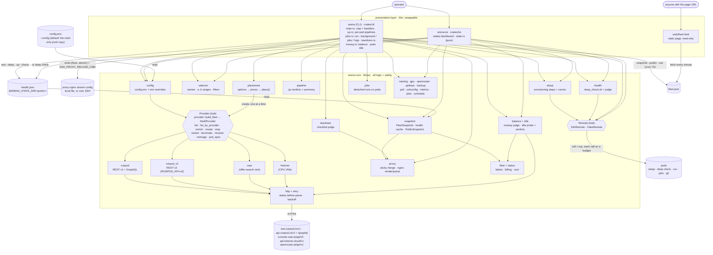

# arena-infra-rs — architecture

A Cargo workspace with one library crate (`arena-core`) holding all logic, and two
thin presentation crates (`arena-cli`, `arena-tui`) that depend on it, plus a static
page (`web/fleet.html`) fed by the CLI's public snapshot. Concrete compute backends hide
behind a single `Provider` trait and every SSH call to a pod behind a single `Remote`
trait, so the CLI/TUI — and any future web layer — never mention a specific provider,
and every fleet path can be tested with fakes. Decisions are pure functions (planners,
judges, renderers) in the core; the I/O around them is kept thin.

```mermaid
flowchart TD
    op([operator])
    viewer([anyone with the page URL])

    subgraph present[presentation layer · thin, swappable]
        CLI["arena (CLI) · crates/cli<br/>main.rs: clap + handlers · up.rs: per-pod pipelines<br/>jobs.rs: run --background / jobs / logs · teardown.rs<br/>money.rs: balance · pods idle"]
        TUI["arena-tui · crates/tui<br/>ratatui dashboard · state.rs (pure)"]
        WEB["web/fleet.html<br/>static page, read-only"]
    end

    op --> CLI
    op --> TUI
    viewer --> WEB

    subgraph core[arena-core · library · all logic + safety]
        Config["config<br/>config.env + env overrides"]
        Fleet{{"Provider (trait)<br/>provider::build_fleet → MultiProvider<br/>list · list_by_provider · enrich · create · stop<br/>restart · terminate · rename · reimage · pod_spec"}}
        RP1["runpod<br/>REST v1 + GraphQL"]
        RP2["runpod_v2<br/>REST v2 (RUNPOD_API=v2)"]
        Vast["vast<br/>(offer-search rent)"]
        Hz["hetzner<br/>(CPU VMs)"]
        Http["http + retry<br/>status before parse · backoff"]
        Sel["selector<br/>names · a..b ranges · filters"]
        Place["placement<br/>options → prices → place()"]
        Pipe["pipeline<br/>up verdicts + summary"]
        Setup["setup<br/>provisioning steps + runner"]
        Health["health<br/>deep_check.sh + judge"]
        Remote{{"Remote (trait)<br/>SshRemote · FakeRemote"}}
        Proxy["proxy<br/>sticky merge · nginx render/parse"]
        Snap["snapshot<br/>FleetSnapshot · health cache · PublicSnapshot"]
        Tear["teardown<br/>checklist judge"]
        Money["balance + idle<br/>runway judge · idle probe + verdicts"]
        Labels["fleet + status<br/>labels · billing · cost"]
        Jobs["jobs<br/>detached runs on pods"]
        Misc["naming · gpu · openrouter · apikeys · backup<br/>pull · sshconfig · metrics · plan · schedule"]

        Config --> Fleet
        Fleet --> RP1 & RP2 & Vast & Hz
        RP1 & RP2 & Vast & Hz --> Http
        Place -->|"create, one at a time"| Fleet
        Setup --> Remote
        Health --> Remote
        Snap --> Labels
        Snap --> Proxy
        Tear --> Proxy
        Money --> Http
        Money --> Labels
    end

    CLI --> Config
    TUI --> Config
    CLI --> Sel & Place & Pipe & Setup & Health & Proxy & Snap & Tear & Jobs & Money & Misc
    TUI --> Snap & Sel & Setup & Health & Money & Misc
    CLI --> Remote
    TUI --> Remote

    cfg[("config.env<br/>--config (default: the read-only prod copy)")] -->|read| Config
    Http -->|HTTPS| APIs[("rest.runpod.io/v1 · api.runpod.io/v2 + /graphql<br/>console.vast.ai/api/v0 · api.hetzner.cloud/v1<br/>openrouter.ai/api/v1")]
    Remote -->|"ssh / scp, each call on a budget"| pods[("pods<br/>setup · deep check · run · jobs · git")]
    CLI -->|"write (flock, atomic) + SSH_PROXY_RELOAD_CMD"| nginx[("proxy nginx stream config<br/>local file, or over SSH")]
    CLI -->|"test --deep · up --check"| cache[("health.json<br/>$ARENA_STATE_DIR/&lt;prefix&gt;/")]
    TUI -->|"d: deep check"| cache
    cache -->|read| Snap
    CLI -->|"snapshot --public --out (cron */2)"| json[("fleet.json")]
    WEB -->|"fetch every minute"| json
```

## Crates

| crate | binary | role |
|-------|--------|------|
| `arena-core` | — | config parsing, the `Provider` trait + RunPod v1/v2, Vast, Hetzner backends + `build`/`build_fleet` factories, the `Remote` SSH seam, every planner and judge (selector, placement, pipeline, proxy merge, health, snapshot, teardown, jobs, balance, idle), the `Pod`/`PodSpec` model, errors |
| `arena-cli` | `arena` | clap CLI over the library: `pods …` (list/create/up/setup/stop/restart/rename/reimage/replace/migrate/terminate/backup/pull/init-branches/set-branch/run/jobs/logs/test/copy-keys/cp), `pods idle`, `proxy plan/apply`, `snapshot`, `teardown --check`, `balance`, `offers`, `gpus`, `keys`, `ssh-config`, `config`, `cron`, `plan`, `tui`. Owns the I/O: the `up` executor (`up.rs`), the job fan-out (`jobs.rs`), the teardown readers (`teardown.rs`), the account reads and idle probes (`money.rs`), proxy deploys |
| `arena-tui` | `arena-tui` | ratatui dashboard: each refresh is one `snapshot::build`; per-pod and marked-set actions behind confirmation modals; background deep checks into the shared health cache; the account balance in the summary bar (its own task, every 5 min) |

`web/fleet.html` is not a crate: a self-contained page that renders `fleet.json`
(`arena snapshot --public`) and can't change anything.

## Core modules

| module | role | pure? |
|--------|------|-------|
| `config` | tolerant `config.env` parser (`KEY=val` + the `MACHINE_NAME_LIST` bash array); any present key can be overridden from the environment, and a short allowlist (`ARENA_START_DATE`, `EXTRA_SSH_KEYS`, `HF_TOKEN`, `CLAUDE_CODE_OAUTH_TOKEN`, `SSH_PROXY_RELOAD_CMD`, `RUNPOD_API`, `ARENA_STATE_DIR`) may be introduced from it | parse: yes |
| `provider` | the `Provider` trait, `build` (one backend by name) and `build_fleet` (`MultiProvider`: lists every configured backend, creates on the `--provider` one, routes per-pod calls to the owner). `list_by_provider` keeps each backend's own Ok/Err — a failed listing is never "no pods". List calls bounded at 60 s (`LIST_TIMEOUT`); mutating calls deliberately aren't | trait + I/O |
| `provider::runpod` / `runpod_v2` | RunPod REST v1 (which RunPod retires on 2026-11-15) and REST v2 (`RUNPOD_API=v2`: paginated listing, real lifecycle statuses, explicit `cloud`, account SSH keys merged into `PUBLIC_KEY`). Rename, maintenance windows, the GPU catalog and network volumes use GraphQL (v2 also has a REST catalog and volume list) | builders/parsers pure |
| `provider::vast`, `provider::hetzner` | Vast rents the cheapest matching *offer* (name carried as the instance label — its offer search still sends the flat query body Vast now rejects, see FEATURE_MAP); Hetzner creates CPU VMs sized by `HETZNER_*` | parsers pure |
| `http`, `retry` | every response's **status is read before its body is parsed**, so a 401 with an HTML body is classified `Auth`, a 429/5xx transient, a capacity message `Capacity`; `retry` backs off on transient errors only | yes |
| `remote` | the `Remote` trait (`exec`, `copy`, `copy_recursive`, each with a timeout): `SshRemote` stops a timed-out ssh/scp with SIGTERM then SIGKILL; `FakeRemote` (feature `test-util`) scripts replies, delays and failures per host | trait + I/O |
| `selector` | one target syntax for every fleet command: bare/full/`@` names, ids, `a..b` ranges in list order, `all`, `--exclude`, `--gpus N`, `--on`; typos and empty selections are errors | yes |
| `placement` | `--gpu A,B --cloud x,y --max-price P --order`: expand → price (`PriceBook`) → cap → order (`plan_options`, shared by `offers`, dry-runs and the prompt); `place()` fills names one create at a time, blocking an option for the round on capacity | planning pure; `place` generic over `&dyn Provider` |
| `pipeline` | the pure half of `pods up`: stages, verdicts, `replacement_order`, `on_failed_host`, the summary table | yes |
| `setup` | provisioning as data (`provisioning_steps`: image pods = copy deploy key + config command; Hetzner = key + script + run) and a runner (`provision`) with a budget per step (`SetupTimeouts`, `SETUP_TIMEOUT_SECS`) and a boot-race retry | steps pure; runner over `Remote` |
| `health` | `pods test --deep`: the embedded `deep_check.sh` only measures (key=value facts); `parse_deep` + `evaluate` judge them against `HealthPolicy` (driver floor from `MIN_DRIVER_VERSION` or `ALLOWED_CUDA_VERSIONS`, network/disk/load thresholds, maintenance) | yes (script runs over `Remote`) |
| `proxy` | the nginx `stream` config: stable port = `MACHINE_NAME_LIST` index; `plan_forwards` **merges** the previous config with a per-provider listing and removes a forward only when its pod is confirmed gone; render ↔ parse round-trip | yes |
| `fleet`, `status` | the one place a pod's labels (GPU, `$/H`, endpoint, maintenance) and the fleet cost are computed; `is_billing`/`bills_hourly` decide what counts as billing | yes |
| `snapshot` | `FleetSnapshot` (`build`: pods + proxy state + last health), the SSH-port reachability probe behind the `Reach` seam (`SshPortProbe`: TCP connect + sshd's greeting, nothing sent), the prefix-scoped health cache (atomic, locked, 0600), and `PublicSnapshot` — a separate allowlisted struct for publishing (`up` needs the probe's answer) | build + targets pure; probe and cache I/O |
| `teardown` | turns listings, volumes, OpenRouter keys, cron/`at` lines and the proxy file into a ✓ ✗ ? – checklist with fix commands (unknown ≠ empty) | yes |
| `jobs` | detached runs (`pods run --background`): the on-pod wrapper, ids, status, log reads by byte offset | yes |
| `balance` | provider account reads (RunPod GraphQL `myself`, Vast `users/current` — only the balance fields; Hetzner postpaid), the burn (max of the provider's rate and the fleet's billing pods; a failed listing = unknown), runway + ⚠ under `BALANCE_WARN_HOURS`, the table / one-liner / teardown lines | judge + render pure; two bounded, status-first reads |
| `idle` | `pods idle`: the read-only probe script (`/proc/net/tcp` sessions minus our own, `nvidia-smi` ×3, bounded `find`, PID 1 age), its reply parser, the verdict (candidate only when every reading is known and idle; cohort machines only) and the report with printed — never run — commands | yes (script runs over `Remote`) |
| `naming`, `gpu`, `openrouter`, `apikeys`, `backup`, `pull`, `sshconfig`, `metrics`, `plan`, `schedule`, `ssh`, `table` | name allocation (`@` absolute entries), GPU aliases + catalog check, OpenRouter provisioning API, key distribution, git backup / rsync commands, participant `~/.ssh/config`, TUI probe, scheduled plans, `wNdM` labels, ssh/scp argv, table layout | mostly |

## Request flow (example: `arena pods up apple --gpu A4000,3070 --cloud community --max-price 0.30 --check`)

1. `Config::load` reads `--config` (default: the read-only prod copy) and applies
   environment overrides.
2. `provider::build_fleet("runpod", cfg)` builds the RunPod backend (v1 or v2 per
   `RUNPOD_API`, validated up front) plus every other provider that has credentials.
3. `--gpu` is checked against RunPod's live GPU catalog (`gpu::check_gpu_flag`): a typo
   stops here, before anything is listed or created.
4. The fleet is listed (transient errors retried; if no provider answers it aborts rather
   than read the fleet as empty and create duplicates) and `apple` is skipped if a pod
   already holds the name.
5. Everything the pipelines need is validated *before* anything bills:
   `SETUP_TIMEOUT_SECS`, `MIN_DRIVER_VERSION`, the `ARENA_REPO_*` settings.
6. `placement::plan_options` prices and orders the gpu × cloud options (RunPod's live
   prices, preset estimates as a fallback) and drops what `--max-price` rules out — the
   same plan `arena offers` and `--dry-run` print.
7. `confirm` prompts (or `-y`; with no terminal and no `-y` it refuses).
8. `placement::place` creates `apple` one option at a time; capacity blocks an option for
   the round, `--retry-mins` adds rounds.
9. `up` runs one independent pipeline per pod: wait for its SSH endpoint (one shared list
   per `--interval`) → proxy sync (`proxy::plan_forwards` under a mutex and a file lock;
   write; `SSH_PROXY_RELOAD_CMD`) → `setup::provision` over `Remote` → the deep check over
   `Remote` (`--check`; a FAIL terminates the pod, confirms it gone and recreates the
   name, rejecting a host that already failed) → API keys → `[apple] READY after …`.
10. Verdicts go to the health cache, the proxy is synced once more, and
    `pipeline::render_up_summary` prints the table; the exit is non-zero unless every
    requested name is READY.

## Safety model (cross-cutting)

- **Read-only commands read**: `pods list`, `gpus`, `offers`, `snapshot`, `teardown
  --check`, `balance`, `proxy plan`, `pods test`, `pods idle`, `pods logs` and `pods jobs` (without `--kill`) only
  list, query (GraphQL queries, never mutations) or run read-only commands on pods. Keys travel as `Authorization` headers,
  never in URLs that errors would print.
- **Mutations confirm first**: they print what they'll do and prompt; `-y` skips the
  prompt; with no terminal they refuse unless `-y`. `--dry-run` previews and changes
  nothing. Destructive ones say so: `restart`/`stop` refuse without `--wipe-ok` when the
  container disk (participants' work) would be wiped, `terminate` takes one pod or `--all`
  (no ranges), and the TUI wants the pod's name (or `ALL`) typed back.
- **Unknown is not empty**: a provider that failed to list keeps its proxy forwards,
  fails `teardown --check` as `?` and marks a snapshot partial; with no provider answering,
  `create`/`up` won't allocate names and the proxy isn't written. Unexpected API shapes
  are errors, never "zero pods".
- **The proxy is a merge**: a forward goes only when its pod is confirmed gone; writes are
  serialized and atomic, a failed reload restores the previous config, and
  `SSH_PROXY_RELOAD_CMD=` (empty) makes every write write-only.
- **Bounded everywhere a pod is reached**: every `Remote` call (pod-SSH exec or copy) has a
  budget and provider listings 60 s, so one wedged pod or stalled API can't hang those
  fleet commands. The rsync transfers, which drive their own ssh outside `Remote` — `pods
  pull`, `pods backup`'s file backup (every tick under `cron install --pull`) and the
  replace/migrate via-local copy — get rsync's `--timeout` (I/O silence) plus a wall-clock
  budget (`BACKUP_TIMEOUT_SECS` / 2 h per leg) through `remote::run_local`, which stops the
  child the same SIGTERM-then-SIGKILL way; every cron line also runs under `flock -n`, so a
  slow tick can't stack another on top of it.
- **Publishing is an allowlist**: `snapshot --public` serializes a separate struct with
  only list names, GPU, up/starting/down, health + a fixed-vocabulary reason and
  maintenance times — no IPs, ports, ids, providers, costs or keys (pinned by a leak test).
- **Secrets stay out of git**: `config.env` and `*.key` are git-ignored; `config check`
  shows set/missing only.

## Testing

Per PLAN "Testing strategy": pure planners and judges are table-tested in their modules;
provider behaviour runs against fake `Provider`s (capacity, flapping endpoints, partial
listing failures); every SSH path runs against `FakeRemote` on a paused clock; provider
parsers run against schema-shaped and recorded fixtures. `crates/cli/tests/live_smoke.rs`
is the opt-in, `#[ignore]`d live smoke test that drives the built binary against a sandbox
account (README "Testing").

## Extending

- **New compute provider** → one new `impl Provider` in `crates/core/src/provider/` and a
  line in `provider::build` (plus its own steps in `setup::provisioning_steps` if it isn't
  an image-based container host); no CLI/TUI changes.
- **New fleet datum** → compute it in `arena-core` (a label in `fleet`, a field in
  `FleetSnapshot`) so the CLI, the TUI and — if it's safe to publish — `PublicSnapshot`
  show the same thing.
- **New surface (e.g. a web UI)** → a new crate depending on `arena-core`; all logic
  already lives in the library, so the core is untouched.
